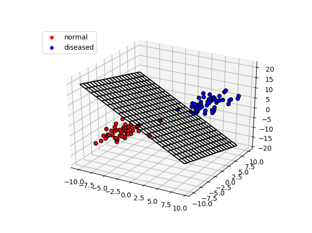

LDA Sample v1
====

## 概要
sklearnライブラリを用いて2クラスの線形判別分析を行うサンプル

## 説明
L次元特徴ベクトルを用いて，線形判別分析(LDA)により2クラスの分類を行う．
サンプルの実装では特徴ベクトルは3次元とし，乱数により学習と評価用のデータセットを生成するよう構成している．
データのフォーマットとしては，特徴ベクトルとクラスを1行にカンマ区切りで並べている．
フォーマットが同じであれば任意のデータに差し替え可能である．

実行すると，学習と評価のデータ生成が行われ，その後学習データを用いて識別器を求め，評価用データで認識率を求めて出力する．
データセットの生成では，3次元の特徴ベクトルの場合は空間を可視化しているため，'q'ボタンを押して実行を進める必要がある．
生成したデータはdataフォルダに格納される．

LDAでは，クラス間距離の最大化とクラス内分散の最小化を同時に行う評価関数を定義し，最大化問題を解くことで求まる射影変換ベクトルを利用して判別を行う．
サンプルの場合，L次元特徴ベクトルを与えると3次元に削減して（現状ではL=3なので削減はしていない）処理が行われる．

## 参考資料
[クラス分類に関する資料はこちら](https://github.com/yoshimoto56/ML/blob/master/Classification/Classification.pdf)
