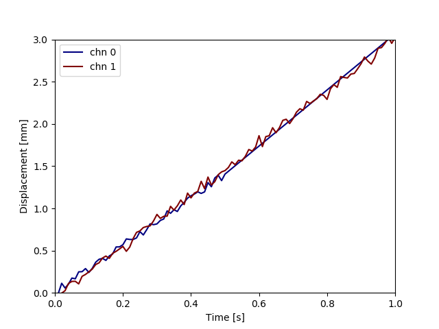

LM Sample v1
====

## 概要
sklearnライブラリを用いて多入力1出力の線形回帰を行う[サンプル](https://github.com/yoshimoto56/ML/blob/master/Regression/LM_sample.py)

## 説明
L次元の入力データを用いて，線形回帰(LM)により1次元の信号の推定を行う．
サンプルの実装では入力データは5次元とし，出力データは3次元のうちの最初の1次元のみを利用するようにしている．
データのフォーマットとしては，入力・出力ともに時刻，各チャンネルの信号を時系列に並べた構造としている．

    time,chn1,chn2,chn3,...
    
    0,0.1234,0.321,0.111,...

    ...

また，入出力でサンプリング時刻が揃っていなくても線形補間で同時刻のデータを計算するようにしている．
フォーマットが同じであれば任意のデータに差し替え可能である．

実行すると，係数ベクトルW，切片b，決定係数R^2，RMSE，最大値で正規化したRMSEが表示される．
また，同期された入出力のデータ，入出力の時系列プロット，各チャンネルの入出力関係のプロット，真値と推定値の出力に関するプロットがdataフォルダに格納される．

## 参考資料
[回帰に関する資料はこちら](https://github.com/yoshimoto56/ML/blob/master/Regression/Regression.pdf)
